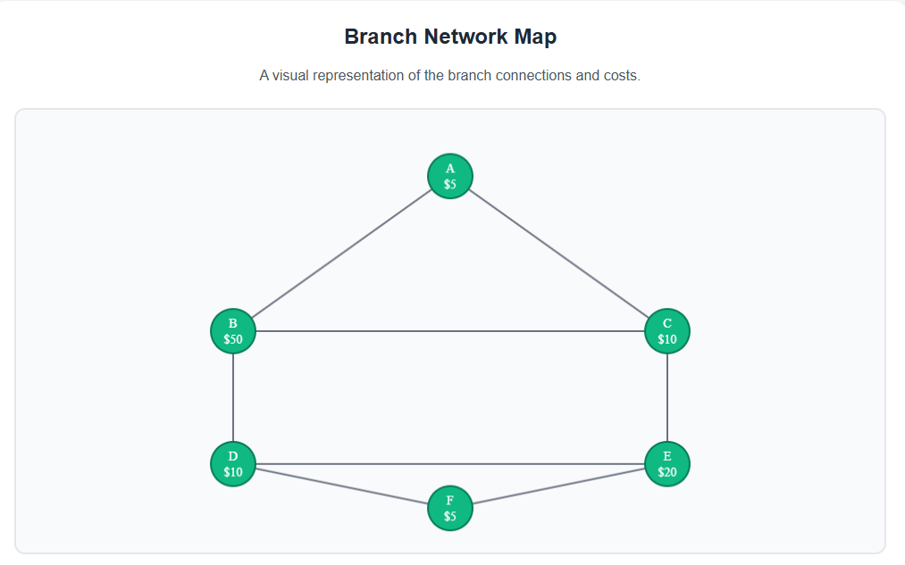

# Payment Service

This project provides a solution to compute the cheapest way to make a payment between two bank branches in a limited
network.

It leverages **Dijkstra’s algorithm** to determine the lowest-cost path for transferring funds, ensuring efficient
payment routing.

The application is built with **Java 17** and **Spring Boot 3**, and exposes a **REST API** for processing payment
requests.  
Interactive API documentation is available via **Swagger UI** at:  
👉 [http://localhost:8080/swagger-ui/index.html#](http://localhost:8080/swagger-ui/index.html#)

---

## 📌 Branch Network Map

Below is a visual representation of the branch network, including processing costs and one-way connections:



### Branch Costs

| Branch | Cost |
|--------|------|
| A      | 5    |
| B      | 50   |
| C      | 10   |
| D      | 10   |
| E      | 20   |
| F      | 5    |

### Branch Connections

- **A → B, C**
- **B → D**
- **C → B, E**
- **D → E, F**
- **E → D, F**

---

## 🚀 Running the Application

### Prerequisites

- Java 17+
- Maven 3.8+
- Git

### Build and Run

1. Clone the repository:
   ```bash
   git clone https://github.com/naziasultan/payment-service.git
   cd payment-service
   ```
2. Build the project with Maven:
   ```bash
   mvn clean install
   ```
3. Run the Spring Boot application:
   ```bash
   mvn spring-boot:run
   ```
   The service will start on: **http://localhost:8080**

---

## 📡 API Endpoints

- `POST /api/payments/route`  
  Computes the cheapest path between two branches.  
  Example request:
  ```bash
  curl 'http://localhost:8080/api/payments/route?origin=A&destination=D'
  ```

- Swagger UI available at:  
  👉 [http://localhost:8080/swagger-ui/index.html#](http://localhost:8080/swagger-ui/index.html#)

---

## ⚙️ Technologies Used

- **Java 17**
- **Spring Boot 3**
- **Maven**
- **Swagger (OpenAPI)**

